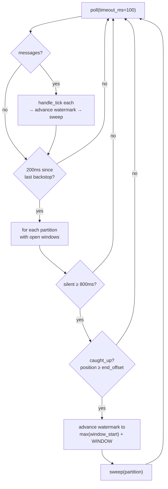

# Closing windows on a quiet partition

*Design record — seal trigger. Changelog entry: [Seal trigger](../CHANGELOG.md#seal-trigger--closing-windows-on-a-quiet-partition).*

## The problem

[Stage 3.5](watermarks.md) fixed the shared-watermark bug but left sealing bolted to tick
arrival. The sweep runs only inside `handle_tick`, and the event-time watermark only advances
when a tick pushes the maximum event-time seen forward. So a partition that goes quiet never
sweeps: its last windows are fully accumulated but never emitted. Data complete, never
delivered.

Invisible on the simulator, where every symbol ticks continuously — every partition always has
a next tick to drive its sweep. Real on a feed with illiquid symbols. It also becomes
user-visible in Stage 4: a dashboard would simply stop drawing a quiet symbol's last candle,
forever.

## Decision 1 — time-driven backstop, not a change to the normal path

The fix must introduce a second source of "time has moved" that does not ride on message
arrival. The watermark path stays exactly as it is; the backstop only covers the gap.

Alternatives considered and rejected:

- **Punctuation / heartbeats.** Producer emits periodic "nothing happened but time advanced"
  markers on every partition, so no partition is ever truly silent and the watermark advances
  off heartbeats. Common in real feeds (exchanges send periodic snapshots partly for this).
  Rejected because it is a producer-side change to solve a consumer-side problem, and it puts
  synthetic records in the log.
- **Processing-time windows.** Bucket on arrival time instead of event time, so windows close
  on wall-clock by construction. Already rejected in Stage 3: candles must reflect when trades
  happened, not when infrastructure read them.
- **Do nothing.** Legitimate for the current simulator, where the bug is unreachable. Rejected
  because Stage 4 makes it visible and it is the honest next thing.

Worth noting for the record: Flink's `withIdleness()` is the standard reference here, but it
solves a different problem — it marks a partition idle so it stops dragging down a
min-combined stream watermark. Since Decision 1 of Stage 3.5 rejected min-combining, that
failure cannot occur here. Same trigger (silence timeout), opposite purpose: Flink's is
subtractive (stop counting this partition), this one is additive (go do the seal that ticks
would normally have done).

## Decision 2 — the two clocks are incommensurable

The obvious implementation is `wall_clock_now >= window_end + DELAY`. It is wrong, and the
reason matters.

`window_end` is an event-time quantity, derived from timestamps the producer stamped.
Wall-clock "now" is the consumer's clock. These are different quantities that drift
arbitrarily.

Proof from the data: the backlog contains two epochs (~1784739xxx and ~1785090xxx) from
producer runs days apart. Replaying today, `wall_clock_now` is days ahead of every
`window_end` in the log, so that comparison is true for every window immediately — the first
timer tick would seal everything, including windows mid-fill.

So the backstop's trigger must be wall-clock versus wall-clock: anchored to activity, never
compared against event-time window ends.

**Corollary worth keeping.** `window_end + DELAY` and `watermark >= window_end` are the same
condition with `DELAY` moved across the inequality. Substituting `watermark = max_seen − DELAY`
into `watermark >= window_end` gives `max_seen >= window_end + DELAY`. The grace can be
expressed as a property of the watermark or of the window; it is the same gap either way.

## Decision 3 — advance the watermark, don't seal directly

This is the central decision and it replaced a substantially more complex design.

**The path not taken.** The first design had the backstop seal windows directly — sweep the
quiet partition and emit. That immediately created a cascade:

- The backstop seals on wall-clock while the event-time watermark is still behind the sealed
  window (that is the whole point — it closes windows the watermark cannot reach).
- So a later straggler for that window passes the existing `watermark >= window_end` drop
  check, finds no accumulator in the dict, and is treated as a brand-new window. A second,
  partial candle gets emitted for a key already closed. Double-emit.
- Fixing that requires remembering which windows were backstop-sealed — a tombstone in the
  dict, or a separate set.
- Which requires eviction, or it leaks.
- Eviction on watermark-advance covers the revival case but not permanent silence (the
  watermark never advances), so wall-clock eviction would be needed too — a second clock
  driving a second mechanism.

Every problem in that cascade traces to one thing: the backstop bypassing the watermark.

**The chosen design.** Don't bypass it. On timer fire for an idle partition, advance the
watermark to `max(window_start over open windows) + WINDOW`, then call the existing sweep.

```python
target = max(w_start for (sym, w_start) in windows[p]) + WINDOW
watermarks[p] = max(watermarks[p], target)
sweep(p)
```

What this buys:

- **One seal path, not two.** The backstop feeds the existing mechanism rather than duplicating
  it.
- **The straggler hole closes for free.** After the backstop runs, `watermarks[p] >=
  window_end` for every window it sealed. A late tick hits the existing drop check and drops
  correctly. No tombstones, no eviction, no leak, no second clock.
- **Monotonicity preserved.** `max(current, target)` — the Stage 3.5 invariant survives.
- **No clock mixing.** Wall-clock decides *when* to intervene; the new watermark value is pure
  event-time, derived from window ends already held in state. The Decision 2 trap is avoided by
  construction.

**It also deleted a knob.** The original design had a per-window `last_updated` wall-clock
stamp, with the backstop sealing selectively (`now - last_updated >= DELAY`) so a window still
in grace during a momentary silence was not closed prematurely. That reasoning was right, but
the check turns out to be unconditionally true: a window can only be updated by a tick on its
partition, so `window.last_updated <= last_activity[partition]` always. If the partition has
been silent 800ms and `IDLE_THRESHOLD > DELAY`, every window on it has been untouched longer
than the grace period. Seal-everything-on-an-idle-partition is therefore justified rather than
sloppy, and the per-window stamp is unnecessary.

## Decision 4 — two knobs, two jobs

- **Per-window grace** (`DELAY`, 200ms) — guards against late ticks for a specific window. *Has
  this window waited long enough that a straggler is unlikely?*
- **Partition silence threshold** (`IDLE_THRESHOLD`, 800ms) — guards against firing the
  backstop on a partition that is merely between ticks. *Has this partition been dead long
  enough that I should stop trusting the normal path?*

Different failure modes, so equal values would be coincidence, not requirement. The silence
threshold wants to be comfortably larger than typical inter-tick spacing so the backstop stays
dormant while the normal path is working — and larger than `DELAY`, since straggler tolerance
is a smaller concern than genuine idleness.

The ordering `IDLE_THRESHOLD > DELAY` is **load-bearing, not decorative**: it is what makes
seal-everything-on-idle safe (see Decision 3). Inverting it would seal windows still
legitimately in grace.

800ms is calibrated to the simulator's tick rate, same as the 200ms grace. On a real feed, "how
long is genuinely dead" depends on the symbol's liquidity — a symbol that legitimately trades
once every few seconds should not be declared dead at 800ms. The value is simulator-specific;
the reasoning (sized to idleness, not straggler tolerance, and larger than `DELAY`) is what
transfers.

## Decision 5 — `poll()` instead of the iterator

`for message in consumer:` blocks until a message arrives. Nothing below it can run while the
feed is silent, so there was nowhere to put a timer — even code written into that loop would
sit below the blocking call and never be reached.

`consumer.poll(timeout_ms=100)` returns whatever is available, or an empty dict after 100ms if
nothing came. Control returns either way. **The empty return is the timer tick.**

That restructures the loop into two parts with different triggers: the message loop runs when
data arrives; the backstop runs every cycle regardless. It must sit at `while` level, not
inside `batch.items()` — nested there it only executes when messages arrive, i.e. never in the
case it exists for.

Secondary consequence: `poll` returns messages batched by partition
(`{TopicPartition: [messages]}`), so the consume loop becomes nested — outer over partitions,
inner over messages.

The 100ms is how often the idle condition is checked, independent of the 800ms threshold being
tested. Under load the loop runs faster (`poll` returns as soon as data exists); under silence
it is exactly 100ms per cycle.

## Decision 6 — idle is not the same as quiet

`last_activity` measures arrivals at the consumer. It cannot distinguish:

- Partition has read to the end of its log — genuinely nothing more coming. Backstop *should*
  seal.
- Partition has hundreds of records unfetched, because a single consumer is busy draining
  another partition. Backstop *must not* seal.

If the backstop fires in the second case it advances the watermark past pending data's windows;
those records then arrive to sealed windows and drop. One partition's drain speed corrupting
another partition's output — the same shape as the Stage 3 mass-drop bug, in wall-clock
clothing.

The gate is therefore two conditions: wall-clock quiet **and** caught up to the log end.

```python
def caught_up(consumer, partition):
    tp = next((t for t in consumer.assignment()
               if t.topic == MARKET_TOPIC and t.partition == partition), None)
    if tp is None:
        return False
    end = consumer.end_offsets([tp])[tp]
    return consumer.position(tp) >= end
```

- `position(tp)` — local, the offset to read next. Free.
- `end_offsets([tp])` — blocking broker round-trip; only the broker knows the log's end.
- `t.topic == MARKET_TOPIC` in the lookup because `assignment()` spans all subscribed topics —
  load-bearing now that a `bars` topic exists and partition numbers collide across topics.
- `tp is None → False` — a partition no longer owned is not sealed by this consumer. Its state
  belongs to whoever holds it now. (Stale `windows[p]` entries after revocation remain a
  separate cleanup concern.)

**Rejected alternative:** three consumers, one partition each. That would also fix the
starvation, since no partition ever waits behind another's fetch. But it is the
correct-by-configuration answer already rejected twice — it holds only while all three stay
alive, and one failure puts a survivor on two partitions with the bug live. `caught_up` makes
consumer count irrelevant to correctness.

**Evidence this was a live hazard, not a hypothetical.** In the pre-fix run, partition 1's very
first message triggered a seal:

```
Partition: 1, symbol: INTC, seq:0, offset:896
SEAL INTC window[1784739347.0] ...
Partition: 1, symbol: INTC, seq:1, offset:897
```

`position` was 897 against an end offset of 958 — 61 records still unread when the window
closed. Post-fix, same point in the same backlog, no seal; the first INTC seal waits until
offset 899, driven by the watermark.

## Decision 7 — throttle the backstop

`end_offsets` is a blocking network call, placed inside a loop that spins hundreds of times per
second during a drain.

The guard "only ask the broker about partitions that look quiet" was expected to make it rare.
It does not. During an uneven drain, a partition that has finished is quiet *permanently* for
the remainder of the drain — it passes the quiet check on every iteration and fires a
round-trip every time. Those requests share the client the fetcher uses, so they do not just
add time, they make the data path wait.

Symptom: the drain slowed to a crawl and appeared frozen at a reproducible offset.
(Same-place-twice is what marked it systematic rather than incidental.)

Fix — decouple the backstop's frequency from the loop's:

```python
BACKSTOP_INTERVAL = 0.2
...
if now - last_backstop >= BACKSTOP_INTERVAL:
    last_backstop = now
    for p in list(windows.keys()):
        ...
```

An 800ms threshold checked 5×/sec still fires within 200ms of crossing. Behaviour identical,
broker calls down two orders of magnitude.

**Transferable shape:** a cheap operation becomes a bottleneck by sitting in a hot path, and
the fix is usually to decouple its frequency from the loop's rather than to make the operation
faster.

## The complete path



## Verification

Method as in Stage 3.5 — replay the identical fixed backlog, fresh group id, one consumer
holding all three partitions.

**Before (backstop removed).** All three partitions drain; the log ends on arriving messages
with no seals following. `grep -c 1785090560` → 0. Five windows fully accumulated, never
emitted.

**After.** All three partitions drain to their ends (2→1983, 0→1993, 1→957). Every seal during
the drain comes from the watermark path — one window per symbol, advancing by exactly 1.0s, no
gaps. Zero DROP lines. Then a single burst:

```
SEAL TSLA / NVDA / AAPL / MSFT / INTC  window[1785090560.0]
```

`grep -c 1785090560` → 5.

The two behaviours are cleanly separated: the backstop produced nothing during the drain and
everything at the end — dormant while the normal path works, active when it cannot.

## Still open

**Post-seal straggler on a revived partition.** Closed in principle by Decision 3 (the
watermark advance means the existing drop check covers it), but only for windows the backstop
actually sealed. Not exercised — reproducing it needs a partition to go quiet, seal, and then
receive a tick whose event-time lands back in the sealed window, which the continuous simulator
cannot produce.

**Stale state after revocation.** `caught_up` returns `False` for an unowned partition, so its
windows are never backstop-sealed — correct, but the `windows[p]` entry lingers. Belongs with
the rebalance work.

**`caught_up` reproduction is timing-dependent.** The premature-seal hazard is a genuine race,
and once the throttle removed the slowdown, drains got fast enough that partitions rarely sit
800ms quiet with data pending. Documented by reasoning rather than by a captured failure log;
forcing it would require artificially slowing the consume loop.

## Process notes

- **Buffering masked a non-problem as a problem.** Piping to `tee` block-buffers Python's
  stdout, so the terminal lagged thousands of lines behind the actual position and repeatedly
  looked like a hang. `python -u` or `flush=True` when piping.
- **The nesting-level slip recurred.** Four times counting Stage 3.5's two — the message loop
  missing its inner level, and the backstop block indented inside `batch.items()`. The
  structure is correct each time; it is the innermost/outermost level that drops under
  keystroke pressure. Worth a pre-run check that each block sits at the level its *trigger*
  requires, not the level it was typed at.
- **Implicit initialisation.** `windows[partition]` existed only because `sweep`'s `setdefault`
  created it as a side effect before the assignment branch ran. Correct, but the guarantee
  lived in another function; reordering the two calls would break it with a `KeyError` at a
  line that had not changed. Now stated explicitly at the top of `handle_tick`.
- **Evidence was not captured at the time.** The runs demonstrating both bugs were pasted into
  chat, not saved. Log A (no backstop) and Log C (fixed) were regenerated; the `caught_up`
  failure could not be. Going forward: any run that demonstrates something gets `tee`'d to a
  named file when it happens.