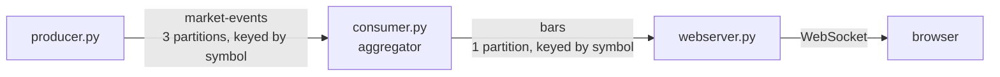

# Publishing sealed candles

*Design record — Stage 4. Changelog entry: [Stage 4](../CHANGELOG.md#stage-4--publishing-sealed-candles-in-progress).*

## Pipeline

## Decision 1 — why a `bars` topic at all

Rejected: `emit` pushing straight to a WebSocket. The topic buys fan-out with independent
cursors (multiple readers, none known to the aggregator), lifecycle decoupling (restart the web
server, missed candles are still on disk), and a durable record.

Latency cost is single-digit milliseconds against a 200ms deliberate grace on a 1s cadence —
noise against the budget it sits in.

*Correction worth keeping:* backfill was the initial argument for the topic and turned out
weaker than it first appeared. The log gives bulk-recent history, not per-symbol-recent, since
one partition carries several symbols interleaved. See Decision 5.

## Decision 2 — keyed by symbol

Kafka orders only within a partition, so keying by `(symbol, window_start)` or not keying at
all would scatter one symbol's bars across partitions and lose ordering. Keying by `symbol`
puts every AAPL bar on one partition in produce order. `window_start` lives in the payload,
where a reader needs it to place the candle, not in the key, where it would only break
ordering.

The upstream half holds: a symbol's ticks arrive on one partition, that partition's watermark
only moves forward, and the sweep seals windows the watermark has passed. So seals are
monotonic per symbol at the point of emit, and the ordering guarantee is unbroken from tick to
browser.

## Decision 3 — one partition

Bar volume scales with symbol count, not tick rate — one message per symbol per window
regardless of how many ticks fed it, so ~5/sec at this scale, against a partition that handles
orders of magnitude more.

Unlike `market-events`, the count is not frozen. Consumers of `bars` hold no partition-keyed
state, so repartitioning would at worst reorder a candle briefly rather than corrupt an
aggregation. This is reversible if consumer lag ever appears.

The scaling story, if servers ever stop needing every symbol: shard the web servers by symbol
range and have each subscribe only to the partitions carrying its range. Not built — the
condition that would justify it is thousands of symbols and hundreds of browsers.

## Decision 4 — each web server instance gets its own group id

A consumer group *divides* partitions between its members. Fan-out to browsers needs every
instance to see every symbol — a browser connected to instance B asking for AAPL must be served
even if AAPL's partition was assigned to instance A. Those are opposite requirements, and this
is the one place in the project where the group abstraction is the wrong tool.

Separate group ids means each instance reads the whole topic independently with its own cursor.
Consequence: partition count stops mattering for scaling — you scale by adding groups, not
members.

## Decision 5 — backfill from memory, not the log

A browser connecting mid-session has no cursor and sees a blank chart, filling in one candle
per second. The fix is a per-symbol deque in the web server, dumped on connect before live
updates begin.

The log cannot serve this cheaply: partition 0 carries AAPL and MSFT interleaved, so offset
arithmetic gives bulk-recent, not per-symbol-recent. Committed offsets do a different job —
stopping the web server re-reading the whole topic on restart. Two mechanisms, two jobs:
offsets for process restart, in-memory buffer for browser connect.

## Decision 6 — bar schema

`symbol`, `window_start`, `window_end`, `open`, `high`, `low`, `close`, `count`.

`window_end` is explicit rather than derived from a window width the reader is assumed to know.
The general principle: **a message should be interpretable without knowledge of the producer's
configuration.** The log holds candles produced under whatever configuration was live at the
time, so bars from different window widths coexist in it, and a hardcoded constant in the
reader cannot interpret both.

`count` is carried because nothing else in the message determines it, and because it is where
volume-weighted statistics attach later.

JSON was chosen for inspectability — messages are readable in the Kafka UI, which is how output
is verified today. Avro or Protobuf with a schema registry would cut roughly 200 bytes to
around 50 (most of the size is repeated field names and floats as decimal text) and would
reject malformed messages at write time. Neither matters at this volume; deferred.

## Decision 7 — duplicate resolution deferred

A rebalance can produce two bars for the same `(symbol, window_start)`, and auto-commit being
window-unaware means one of them may be built from partial data. Overwriting on key is
therefore not unconditionally safe for a downstream reader — a partial candle arriving second
would silently replace a good one.

Commit-on-seal (see below) removes the partial case, after which duplicates are identical and
overwriting is correct. Reaching this case requires a deliberate mid-run rebalance; it is
unreachable in normal single-consumer operation.

## Decision 8 — the aggregator publishes from `emit`

`consumer.py` gains a `KafkaProducer` — the standard consume-transform-produce shape. A
separate publishing process would need a channel to receive the sealed candle (a topic, a
socket, a queue), so it is an extra hop for the same result.

The boundary that matters is the **function**, not the process: everything downstream reads
`bars` and knows nothing about windows or watermarks. The genuinely separate process is the web
server, which has a different lifecycle and scales independently.

## Decision 9 — async send with an errback

`send()` does not send. It serializes, picks a partition from the key, appends to an in-memory
buffer and returns a future; a background thread batches and ships. Blocking on that future
(`.get()`) per bar would serialise what the client is built to batch and stall the consume loop
on a network round-trip once per seal — the same shape as the `end_offsets` stall in
[idle-partitions](idle-partitions.md#decision-7--throttle-the-backstop).

So: async, with `.add_errback()`. Bars are reconstructible by replaying `market-events`, so a
lost write is recoverable; silent failure is the only unacceptable outcome, which the errback
covers.

The callback receives only the exception, so the identity is passed through as extra arguments
— `(symbol, window_start)`, which is exactly the identity settled in Decision 6. It runs on the
I/O thread, so it must stay short and must not touch `windows` or `watermarks`. No resend from
inside it: the client has already exhausted its retries by the time it fires, and the log is
the recovery path.

## Decision 10 — `producer.flush()` before `consumer.close()`

Closing the consumer commits offsets, which claims that everything up to that position is fully
handled. Committing while bars still sit in the send buffer makes that claim false — the
offsets say the work is done while the output never left the machine, and on restart the
consumer resumes past those records.

The general rule: **flush what you produced before you acknowledge what you consumed.**

## Carried forward — commit-on-seal

*Failure/recovery tier, not implemented.*

Auto-commit fires on a timer that knows nothing about window boundaries, and both directions
fail:

- **Commit too early** (cuts mid-window) — the consumer inheriting the partition starts
  part-way through and builds a candle from partial data. Silently wrong, and plausible-looking.
- **Commit too late** — the new owner replays records feeding windows the old owner already
  sealed, and re-emits them. Duplicate candles.

Both are the same problem, so the fix is a different *trigger*, not a different interval.

Track each window's **first** contributing offset. On seal, the safe commit point is the
minimum first-offset across windows still open on that partition — or the read position if none
remain. Commit strictly below that, since a Kafka commit at N declares everything below N
handled, and there is one cursor per partition covering all symbols on it.

This makes every commit position a place where replay reconstructs whole windows: everything
before it is already emitted, nothing after it has been folded into anything that was.

Related, same tier: state for a revoked partition is not cleaned up. A
`ConsumerRebalanceListener` popping `windows[p]` and `watermarks[p]` on revoke is the fix.
Dropping the accumulator rather than sealing it is correct — the window is incomplete, and the
new owner rebuilds it from the log. Local state is a cache, not a source of truth. Checkpointing
state to a compacted topic (the Kafka Streams approach) was considered and rejected: window
state is one second wide, so replay reconstructs it in milliseconds, and revocation usually
follows a crash, where there is no old owner to transfer from.