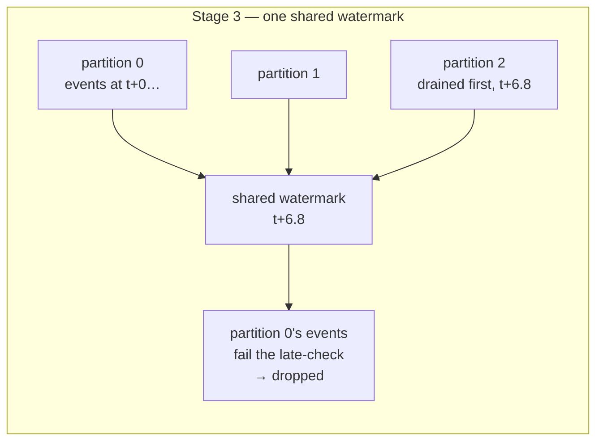

# Per-partition watermarks

*Design record — Stage 3.5. Changelog entry: [Stage 3.5](../CHANGELOG.md#stage-35--per-partition-watermarks).*

## The problem this stage exists to fix

Stage 3 used one watermark variable fed by every partition. That encodes an assumption: all
partitions are at the same point in time. Kafka guarantees ordering only *within* a partition,
so the assumption is false whenever partitions are at different depths — which a fresh
`earliest` replay guarantees.

Observed: one consumer drained partition 2's backlog first, dragging the shared watermark to
~t+6.8. It then started partition 0 from the beginning, where every event was older than that
watermark. Those events failed the late-check and were dropped in a burst — around seven
seconds of AAPL/MSFT/INTC data, for which no accumulator was ever created and no candle ever
emitted. Drops stopped only when partition 0's event times climbed past t+6.8.

Root cause is a **scoping error, not a logic error**: the comparison was right, the operand was
wrong. A watermark is a statement about one channel's progress, and it was being applied to
three.



## Decision 1 — partition-local sealing, not a min-combined stream watermark

The textbook fix is per-partition watermarks combined by minimum into one stream watermark, on
the reasoning that the stream is caught up to T only when every partition has reached T.
Rejected in favour of each accumulator sealing against the watermark of the partition it lives
under.

Suppose partition 1 carries only INTC, and INTC goes quiet. Partition 1's watermark stops
moving at t+3. Partitions 0 and 2 race ahead to t+10. The minimum is t+3, so nothing seals —
AAPL's window ending at t+5 stays open, even though every AAPL tick that will ever exist for it
has already arrived and is sitting in the accumulator.

A slow member is holding up work that it has nothing to do with and therefore cannot affect.
The topic is keyed by symbol, so each `(symbol, window)` accumulator is fed entirely by one
partition — partition 1 contributes nothing to AAPL. Partition-local sealing is strictly
fresher and dissolves the starvation rather than tolerating it.

**The trade accepted.** Min-combining would survive repartitioning; partition-local sealing
would not. If AAPL lands on two partitions, "the partition it lives under" stops being
well-defined, and two accumulators for the same `(symbol, window)` seal independently under two
watermarks. That is why Decision 4 exists.

**A consequence in the design's favour.** A partition not yet seen has watermark `-inf`. Under
partition-local sealing that is harmless: no accumulators there, nothing to seal. Under
min-combining, one unseen partition drags the minimum to `-inf` and freezes the entire stream
forever — a special case would be needed just to start up.

## Decision 2 — nested state, keyed by partition

Three layouts were on the table.

**Option 1 — symbol→partition map.** Keep the flat `(symbol, window)` dict and infer the
governing partition from the symbol. Rejected: it infers partition instead of reading it from
`message.partition`, and assumes for example that AAPL is always on partition 0. Stale entries
would silently point at the wrong watermark, producing candles that look plausible and are
wrong.

**Option 2 — flat with partition in the key.** `windows[(partition, symbol, window)]`. Correct,
but at seal time every entry must be walked and filtered for partition.

**Option 3 — nested (chosen).** `windows[partition][(symbol, window)]`. Inside
`windows[partition]` there is no path to another partition's accumulators — the Stage 3 bug is
structurally unreachable rather than merely avoided. Holding a watermark, `windows[partition]`
hands back exactly the set it governs, with no scan and no filter. And when a partition is
revoked, its state is one `pop`.

`watermarks` stays a separate dict keyed the same way: two dicts, one indexing step each, the
partition id opening both.

```
windows                             watermarks
├── 0                               ├── 0 → 1785090559.8
│   ├── (AAPL, 1785090559.0) → acc  ├── 1 → 1785090557.2
│   └── (MSFT, 1785090559.0) → acc  └── 2 → 1785090560.1
├── 1
│   └── (INTC, 1785090557.0) → acc
└── 2
    ├── (TSLA, 1785090560.0) → acc
    └── (NVDA, 1785090560.0) → acc
```

## Decision 3 — per-partition, not per-symbol

Per-symbol watermarks would also fix the bug, and are strictly finer: AAPL would not even wait
on MSFT, which shares its partition. Rejected on three grounds.

**Semantics.** A watermark is a claim about a delivery channel: nothing older than T will
arrive here from now on. This claim can be made about a partition because it has an order, a
position, and an end offset, and offers the ability to check `position(tp)` against
`end_offsets([tp])`. Symbols offer none of that — a symbol is just a label on messages, with no
notion of offset, position, or being behind. `watermarks["AAPL"]` is only the maximum
event-time seen for that symbol. Nothing about it guarantees an older AAPL tick will not still
come; only partition 0 can guarantee that, since partition 0 is what delivers AAPL.

**Cardinality.** The number of partitions is known beforehand — it is in the topic config and
is fixed. Symbols are discovered at runtime, so a key only appears when a tick with that key
appears. `watermarks[symbol]` grows without bound, and there is no signal telling you when an
entry can be deleted, because a symbol quiet for a long time can reappear. With partitions as
keys, the dict is bounded and revocation is an explicit deletion trigger.

**Rebalance.** Revoking partition 1 is one `pop` under per-partition. Per-symbol, you would
need to know which symbols lived there — the symbol→partition map already rejected in
Decision 2.

**A note on `DELAY`.** Where more than one symbol shares a partition, `DELAY` exists to absorb
ticks arriving out of order, because merging sorted streams produces an unsorted one. A single
symbol's ticks never arrive out of order — they are generated in timestamp order and land in
one partition in order. `DELAY` is therefore a partition-level concern by construction, which
is a third confirmation that partition is the right scope.

## Decision 4 — partition count fixed, consumer count free

**Partition count fixed at 3.** Adding a partition rehashes symbols, so the same symbol lands
on two partitions. Two live accumulators for the same `(symbol, window)` then seal
independently under two watermarks and emit two partial candles for one key — both live,
neither stale. Worse, per-symbol ordering is broken at the broker: the same symbol's ticks are
in flight on two partitions, and Kafka orders only within one. That damage happens before the
consumer sees anything, so no in-consumer layout can fix it. This is an operational constraint,
not a design problem.

Note the failure modes differ in loudness. The rejected symbol→partition map produces one
silently-wrong candle. Nesting under repartitioning produces two obviously-wrong candles,
visible in the output stream. That is the honest argument for nesting: not that it survives
repartitioning, but that it fails visibly.

**Consumer count free.** Pinning the group at three consumers, one partition each, would also
avoid the starvation — but it is the correct-by-configuration answer already rejected in
Stage 3. It holds only while all three stay alive; one failure rebalances a survivor onto two
partitions and the starvation returns. Per-partition watermarks make consumer count irrelevant
to correctness (it still governs throughput and distribution — that is the point of a group).
Proving the fix under a single consumer holding all three partitions is only possible because
the count was not constrained.

## Implementation note

The watermark is not initialised, it is **advanced on every tick**. `event_time - DELAY` is a
*candidate*; the watermark is the running maximum of candidates. Storing it is how the maximum
is remembered.

The reason it must be a max rather than a fresh computation: event times on a partition are not
monotonic (AAPL and MSFT interleave), so a recomputed watermark would move backwards. A
watermark that moves backwards breaks its own promise — a sealed window becomes unsealed, the
next tick for it passes the late-check, a fresh accumulator is created, and a duplicate candle
is emitted for a key already closed. `DELAY` exists precisely because arrival is out of order,
so recomputing without a max would contradict the constant sitting three lines above it.

## Still open after this stage

The sweep runs only for the partition whose tick just arrived. A partition that goes quiet is
never swept, so its last window stays open indefinitely — the data is complete, it simply never
gets emitted. That is the seal-trigger question, unaddressed here and now visible in the code
rather than in the abstract. → [`idle-partitions.md`](idle-partitions.md)